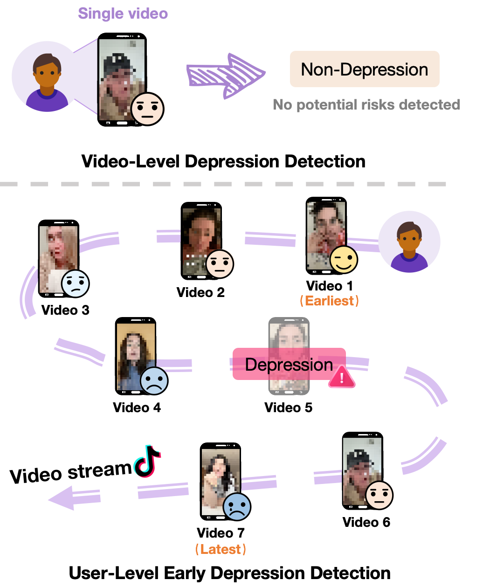

# MUD3: A Multimodal User-Level Dataset for Depression Detection on Social Media Using Video Histories

This repository contains the dataset and supplementary materials for the paper "MUD3: A Multimodal User-Level Dataset for Depression Detection on Social Media Using Video Histories," submitted to ACM MM.

