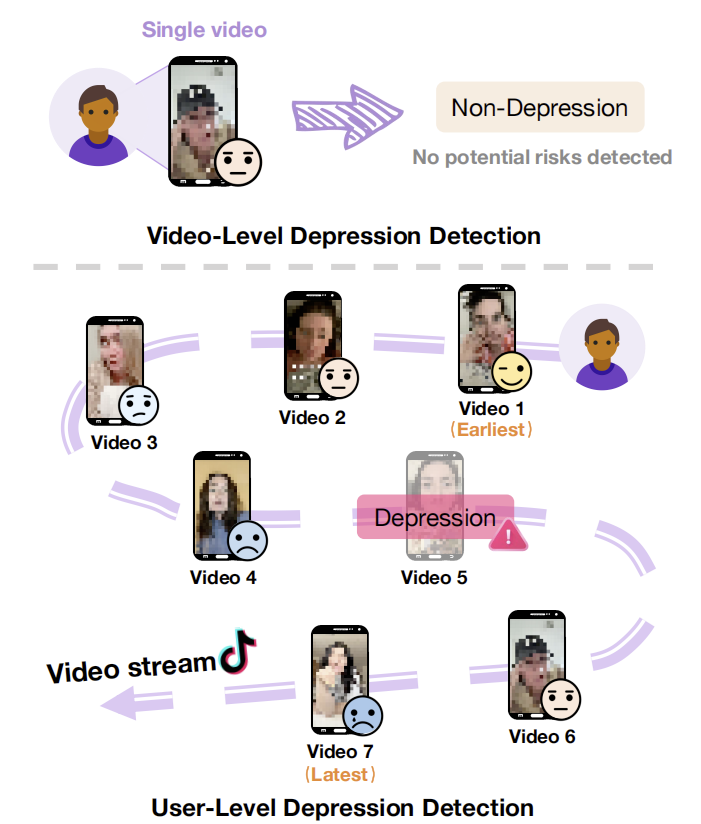
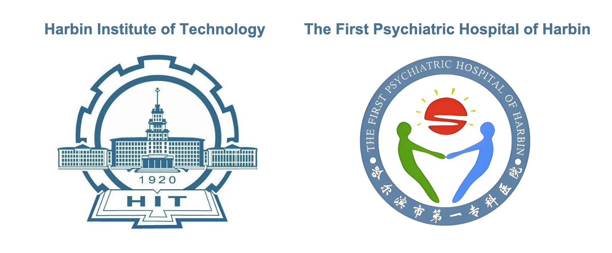

# Beyond Snapshots: A Multimodal User-Level Dataset for Depression Detection in Dynamic Social Media Streams

This repository contains the dataset and supplementary materials for the paper "Beyond Snapshots: A Multimodal User-Level Dataset for Depression Detection in Dynamic Social Media Streams," accepted by ACM MM 2025.   
**➡️ [Click here to view the paper](https://dl.acm.org/doi/10.1145/3746027.3758236)**

<p align="center">
    </p>

## MUD3 Dataset Download

To obtain the MUD3 dataset, you may need to submit an application. Please provide your identity information, affiliation, and purpose of usage when applying for access.
**➡️ [Click here to download the MUD3 dataset](https://drive.google.com/drive/folders/19q0Oi-rOJPvowZHhIINuIVUq-p_CABdz?usp=drive_link)**
```
MUD3 Dataset/
├── dep_feat.pkl
├── nondep_feat.pkl
└── labels.csv
```
The files dep_feat.pkl and nondep_feat.pkl store the extracted features of depressed and non-depressed users’ videos, respectively. The file labels.csv provides the ids, labels (1 for depressed, 0 for non-depressed), anonymized names, and dataset splits (training, validation, and test). 

All video features of each user are retrieved using the user's anonymized name. The videos are ordered chronologically from earliest to latest. Each video feature is represented as a matrix of shape (t, 161), where t denotes the video length and 161 corresponds to the concatenation of 136-dimensional facial features and 25-dimensional acoustic features.

## Keywords for Retrieving Depressed and Non-depressed Users
### Depressed
We select 22 keywords strongly associated with depression to search for relevant videos on TikTok，and each keyword can retrieve approximately 150-190 related videos.

| Keyword                  |              Keyword            |          Keyword         |
|--------------------------|---------------------------------|--------------------------|
| anti depressants         | depression treatment            | my anti depressants      |
| battling depression      | depression vlog                 | my depression diary      |
| depression daily vlog    | depressive disorder             | my depression episode    |
| depression experiences   | depressive episode              | my depression vlog       |
| depression journey       | diagnosed with depression       | my depression            |
| depression patient       | fighting depression             | overcoming depression    |
| depression story         | living with depression          | severe depression        |
| struggle with depression |     |     |


### Non-depressed
The collection of non-depressed users is much simpler. We retrieve videos using keywords related to daily activities，and each keyword can retrieve approximately 150-190 related videos. Since non-depressed users are not subject to the same high exclusion rate as depressed users, we use the following 5 keywords for retrieval. These keywords are selected to maximize the number of lifestyle videos with visible faces.
| Keyword                  |
|:--------------------:|
| daily vlog        |
| grwm vlog        |
| how to vlog        |
| talking vlog        |
| day of vlog        |


## Classification Criteria 
For videos retrieved using depression-related keywords, two annotators classify the users who post the videos into **depressed** and **non-depressed**. Depressed users are identified strictly based on self-reported diagnoses. We develop detailed classification criteria and illustrative examples under the guidance of professional psychiatrists from The First Psychiatric Hospital of Harbin to ensure that the determination of depressed users is strictly in accordance with the requirements.

 - Since our goal is to construct a dataset for long-term analysis of users' depressive states, it is essential to exclude users experiencing short-term depressive moods rather than actual clinical depression. Therefore, users with temporary depressive states, such as seasonal depression or premenstrual depression, are excluded from further consideration. 

 - Additionally, due to the prevalence of influencer culture on short-video platforms, we establish detailed guidelines to exclude users feigning depression for attention. For example, users making stereotypical jokes, impersonating individuals with depression, or running promotional accounts are categorized as ``non-depressed''. 

 - Since our dataset aims to capture the multimodal characteristics of individuals with depression, cases where the user is not the one affected, accounts focused on interviews, creators sharing educational content about overcoming depression, or users who never appear on camera in any videos are also excluded.

Our classification criteria, validated by psychiatric experts, ensure that individuals classified with depression possess definitive diagnostic evidence, thereby excluding ambiguous or borderline cases.


| Depressed            |        Excluded     |
|--------------------------|---------------------------------|
| depression disorder                | clean depression room                              |
| depression episode                   | seasonal depression                               |
| dealing with depression              | premenstrual depression                             |
| diagnosed depression               | high-functioning depression                             |
| bipolar disorder            | anxiety disorder, or taking anti-anxiety medication |
| overcoming depression                | short-term depressive mood                            |
| fighting depression   |  popularization of depression              |
| struggle with depression    | making stereotypical jokes about depression    |
| taking antidepressants（e.g. prozac, zoloft, lexapro, wellbutrin）    | impersonating individuals with depression     |
| postpartum depression    | promotional and clickbait accounts                           |
| pregnancy depression    | accounts focused on interviews                             |
| consultation, hospitalization for depression  | recovered from depression   |
| treatment for depression (e.g. TMS, SSRI)    | faceless accounts        |


## Acknowledgements
This research is a collaborative effort between Harbin Institute of Technology and The First Psychiatric Hospital of Harbin, a Class A tertiary-level hospital specializing in psychiatry and psychology. We sincerely thank the medical professionals at The First Psychiatric Hospital of Harbin for their valuable guidance and professional support during the construction of the dataset.

<p align="center">
    </p>


## Ethical Statement
This research adheres to the highest ethical standards and guidelines. We utilize publicly available video data from social media platforms, ensuring that all privacy concerns are carefully addressed. To protect user confidentiality, the dataset includes only non-identifiable features, specifically facial landmark coordinates and low-level vocal descriptors, with no personal data that can reconstruct original videos. We do not directly involve participants in this research, and all data collection processes follow ethical protocols to avoid any exploitation or distress to individuals. Additionally, this study receives approval from the Institutional Review Board (IRB) from our institution, affirming our commitment to ethical research practices. Our research design considers the potential implications of depression detection technologies, promoting responsible use and ensuring that findings contribute positively to mental health awareness and intervention strategies. 

